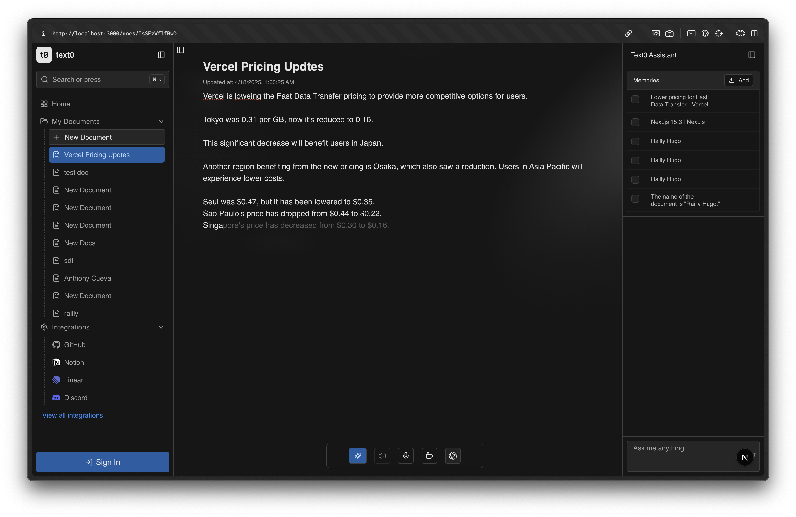
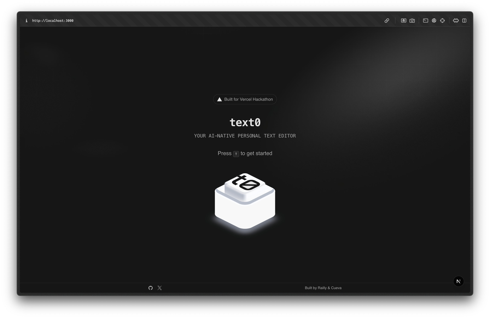
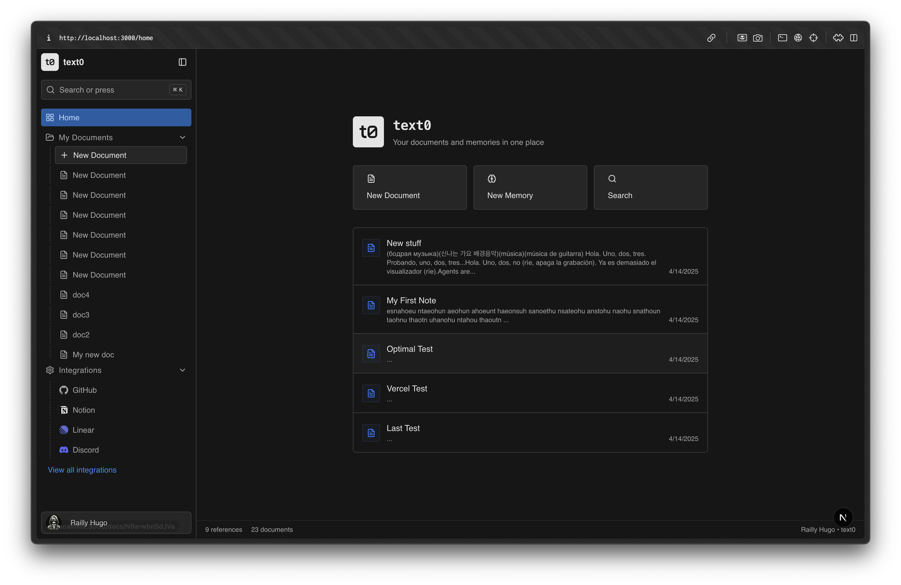

# Text0

A text editor with absurdly smart autocomplete. Text0 serves as a copilot for writing, accessing user-provided references to offer context and help users write faster.



## Features

- Smart autocomplete powered by AI
- Chat with your content 
- Reference-aware suggestions
- Github, Linear and Notion integrations
- Seamless writing experience
- Voice input and output
- Zen mode

## Tech Stack

- React
- Next.js
- Tailwind CSS
- RadixUI
- Upstash Redis
- Upstash Vector
- AI SDK
- UploadThing
- Cursor
- Vercel
- Clerk (Authentication)

## Getting Started

### Prerequisites

- Node.js
- Bun (preferred)

### Installation

```bash
# Clone the repository
git clone https://github.com/crafter-station/text0.git
cd text0

# Install dependencies
bun install

# Start the development server
bun dev
```

## Usage

Visit [www.text0.dev](https://www.text0.dev) to access the hosted version.

To use the local development version, navigate to `http://localhost:3000` after starting the development server.

## Screenshots





## Contributing

Contributions are welcome! Please feel free to:

1. Open issues for bugs or feature requests
2. Submit PRs for new functionality
3. Fork the project for your own use

## License

This project is licensed under the MIT License - see the [LICENSE](LICENSE) file for details.

## Contact

- [Railly Hugo](https://github.com/Railly)
- [Anthony Cueva](https://github.com/cuevaio)
